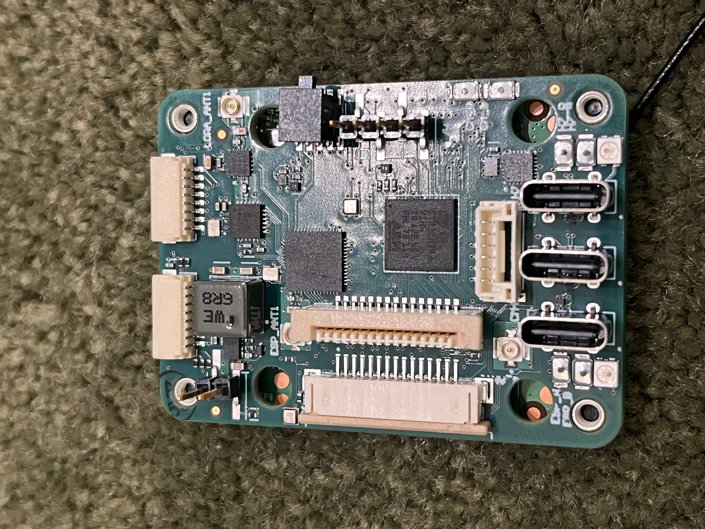

## Putting the *Science* in Mad Science

Welcome to Skerry Technologies, my (currently one-man, completely
unfunded, almost might as well consider it a hobby) Research and
Development operation focused on small Unmanned Aerial Systems.
Although, in all honesty, it more like "mad engineering" rather than
mad science.

## Project Kestrel

The Kestrel design is a small, highly integrated autopilot design for
small drones which couples a Raspberry Pi compute module to an
ardupilot-compatable autopilot board that includes two MIPI CSI2
camera interfaces, a GPS, an IMU, power distribution, and a separate
chip for a LoRa datalink.

### Current Status

- Previous version successfully flew using Ardupilot

### ToDo List

- Port Ardupilot to the current board

- Port ExpressLRS to the ESP32 datalink chip

- Consider a revised design to fix identified bugs, switch to a more
  advanced IMU chip, and other related changes

 

## Project Sparrowhawk

Project Sparrowhawk is in initial planning, looking at developing
clean-sheet software for a low level drone autopilot that takes
advantage of modern, multicore microprocessors and the far more robust
Rust programming language.

## Dr Nicholas Weaver

I obtained his Ph.D. from the University of California
at Berkeley in 2003.  My primary research focus is on digital,
explainable, and commonly adversarial systems.

Within that, however, is a huge range of topics.  Down at the lowest
level i've designed my own custom boards and an FPGA architecture,
while the high level has ranged up to sophisticated network
measurement techniques and economic disruption of nefarious actors.

When it comes to UAS systems my primary focus is on hardware/software
co-design to enable autonomous operation.  I've developed an autopilot
that can mate a Raspberry Pi compute module to an ardupilot-based
autopilot as a proof of concept and I am now working on developing my
own from-scratch autopilot based on co-designed software and hardware.

My CV is [available here](cv.html) and my nontechnical writing is mostly
published at [Lawfare
Media](https://www.lawfaremedia.org/contributors/nweaver)

 