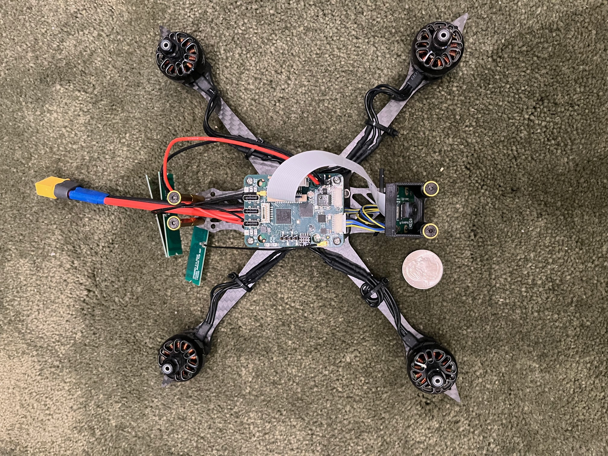

## Putting the *Science* in Mad Science

Welcome to Skerry Technologies, my (currently one-man, completely
unfunded, almost might as well consider it a hobby) Research and
Development operation focused on small Unmanned Aerial Systems.
Although, in all honesty, it more like "mad engineering" rather than
mad science: its all about trying to understand how to extend the
state of the art in small autonomous drones.

## Project Kestrel

The Kestrel design is a small, highly integrated autopilot design for
small drones which couples a Raspberry Pi compute module to an
ardupilot-compatable autopilot board that includes two MIPI CSI2
camera interfaces, a GPS, an IMU, power distribution, and a separate
chip for a LoRa datalink.

The major idea is that by coupling a Raspberry Pi compute module into
a small drone it should be possible to build small, vision based
autonomy in a very low-cost package.  The RP4 compute module has *just
enough* compute to do a reasonable amount of vision processing and, by
coupling it to an independent autopilot, offload all the true
real-time processing to a dedicated coprocessor.

### Current Status

- Previous version successfully flew using Ardupilot
- Current version has partial validation: Power supply, CM4
  interfacing, camera interfacing, and GPS are verified as working.
- Trial physical integration into a small quadcopter using an
  off-the-shelf racing drone frame.

### Hardware ToDo List

- Port Ardupilot to the current board and fly under remote control.
- Port ExpressLRS to the ESP32 datalink chip.
- Implement RemoteID on the ESP32 datalink chip.
- Consider a revised design to fix identified bugs, switch to a more
  advanced IMU chip, support for the CM5 compute module, and other
  related changes.

## Project Sparrowhawk

Project Sparrowhawk is in initial planning, looking at developing
clean-sheet software for a low level drone autopilot that takes
advantage of modern, multicore microprocessors and the far more robust
Rust programming language.

The two primary current open-source autopilot stacks are Ardupilot and
Betaflight.  Ardupilot is a large open-source project written in older
(circa 2010) C++, while Betaflight (a fork of Cleanflight) is a
stripped down design targeting quadcapters written in C.  Also,
although highly integrated in some aspects, neither are designed to
integrate communication, FAA-mandated DroneID, or to take advantage of
modern multicore embedded processors.

The overall objectives are:

- Develop a small, low cost referennce hardware design
- Develop a new software stack for the hardware
- Evaluate Rust's applicability for the embedded environment
- Provide a platform for an integrated systems textbook
- Meet BlueUAS framework requirements for government use

### Intended Hardware Archictecture

The intended autopilot architecture will be a single-sided board with
a 30.5x30.5 mounting form factor with JST connectors.  The board will also
have castillated connections allowing it to be integrated into larger
designs as well.

- CPU:  Raspberry Pi RP2350 in the QFN-80 package
- IMU:  TDK 42688
- Compass: Memsic MMC5983MA
- Barometer: 2x Bosch BMP 390, one with a mounting point to connect to a pitot tube
- GPS: UBlox MIA-M10-Q with an external antenna connector
- WiFi:  Espressif ESP32C3 with a separate connection to the GPS
- LoRa: Semtec, either the LR2021 or SX1280 with an external power
  amplifier
- Power: Unreglated LiPo to 5V buck converter
- Power: 5V to 3.3V LDO

The intended design is small enough that it can be constructed as a
4-layer board and assembled in-house on an existing small pick & place
machine.

### Why Rust?

The use of C and older C++ produces code is inherently unsafe: unable
to be effectively analyzed for correctness and likely rife with memory
errors.  At the same time the hard real-time constraints involved in
operating a drone (a 4-8 kHz update loop that polls the IMU, filters
the noise, and updates the operating state of the motors and
actuators) prohibit the use of any language without C or C++'s
garbage-collector free memory semantics or emphasis on zero-overhead
abstractions.

Thus the only languages that can be safely used to engineer the core
of an autopilot are agressively modern C++ (no raw pointers,
collections with checking assertions enabled, etc) or Rust.  Since
either language choice require effectively either a complete rewrite
of an existing codebase or a clean-sheet design the choice of Rust is
straightforward.

Using Rust will not only gain the inherent safety advantages that are
built into the language from the start (Rust's design philosophy is
similar to C++ in a focus on zero-overhead abstractions but not at the
cost of safety, unlike modern C++ which can only be safe with explicit
programmer discipline), but will also serve as an experiment, allowing
an evaluation of Rust in practice.

### Why multicore?

The Raspberry Pi microcontrollers as well as the ESP32 line from
Espressif have introduced symmetric multicore designs into the
microcontroller space.  These families of microcontrollers not only
offer a significantly lower price point than competing designs from ST
Microsystems but far more flexible I/O structures, allowing one or two
packages to cover most uses.

The new RP2350 in particular is an excellent part.  Full system BOM
cost is less than $3 and it contains a dual core ARM Cortex-M33 at
150MHz with floating point and 30 or 48 highly flexible general
purpose I/O pins.  It also ships with modern code signing and security
features.

## Dr Nicholas Weaver

I obtained his Ph.D. from the University of California
at Berkeley in 2003.  My primary research focus is on digital,
explainable, and commonly adversarial systems.

Within that, however, is a huge range of topics.  Down at the lowest
level i've designed my own custom boards and an FPGA architecture,
while the high level has ranged up to sophisticated network
measurement techniques and economic disruption of nefarious actors.

When it comes to UAS systems my primary focus is on hardware/software
co-design to enable autonomous operation.  I've developed an autopilot
that can mate a Raspberry Pi compute module to an ardupilot-based
autopilot as a proof of concept and I am now working on developing my
own from-scratch autopilot based on co-designed software and hardware.

My CV is [available here](cv.html) and my nontechnical writing is mostly
published at [Lawfare
Media](https://www.lawfaremedia.org/contributors/nweaver)

 